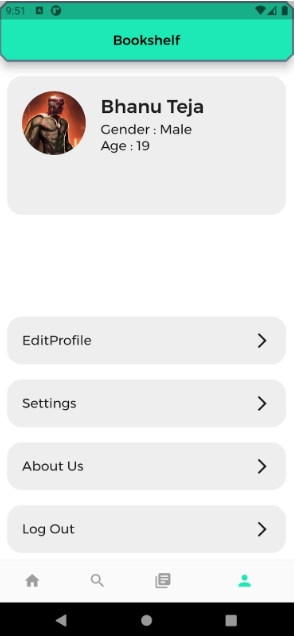

# bookshelf

An Android cross-platform application developed using Flutter that aims to provide a great user
interface that allows users to browse through different categories and genres to find free e-books.

# Screenshots
 
<p>





</p>


# How to run
1. Clone this repo.

   ```terminal
   git clone https://github.com/bhanu-73/IPL-Score-Predictor.git
   ```

2. Install Flutter and all its dependencies, and create a new virtual device:
<https://flutter.dev/docs/get-started/install>.

3. Start the application with ``flutter run`` or run lid/main.dart on your IDE 


